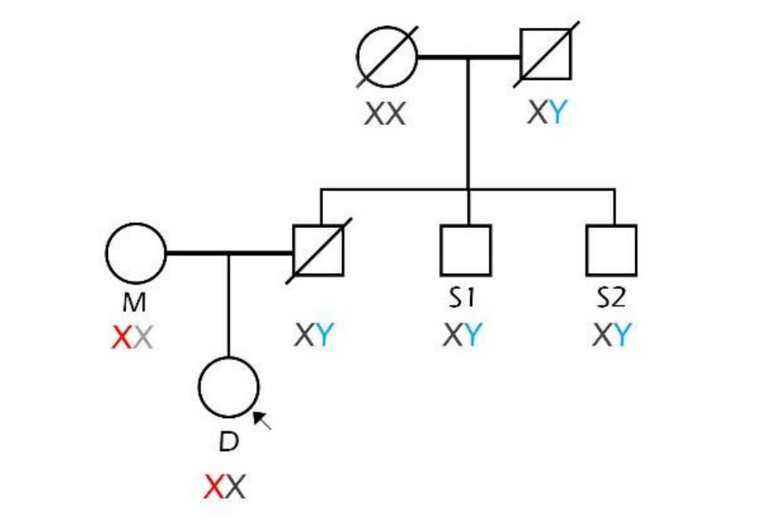

## Zadanie 3 (5b)

V tomto zadaní budete pracovať s nástrojom FamLinkX a datasetom **dna_screening_zadanie** dostupným v priečinku `inputs`. 

Dataset obsahuje údaje matky, dcéry a dvoch strýkov, ktorí sú bratmi muža, u ktorého predpokladáme, že je otcom dcéry. Je potrebné potvrdiť alebo vyvrátiť či bol muž otcom dievčaťa. Pomocou nástroja FamLinkX zostavte hypotézy s rodokmeňom členov, vykonajte analýzu, určte výsledné pravdepodobnosti hypotéz a uveďte výsledné rozhodnutie na potvrdenie/zamietnutie otcovstva.

### Úloha 1 (1b)

**Formulujte hypotézy pre riešenie úlohy:**

Hypotéza 1: Testovaný muž je biologickým otcom dcéry. 
(Teda testovaní strýkovia sú skutoční biologickí strýkovia dcéry zo strany otca).

Hypotéza 2: Testovaný muž nie je biologickým otcom dcéry.
Teda testovaní strýkovia nie sú v žiadnom genetickom príbuzenstve s dcérou.

### Úloha 2 (4b)

Vykonajte analýzu pomocou nástroja FamLinkX. Ako referenčnú databázu použite Českú alebo Nemeckú databázu. Ako prílohu zadania odovzdajte vygenerovaný report z analýzy (Case report vo formáte .rtf). 

**Uveďte LR a pravdepodobnosť (W) pre jednotlivé hypotézy a Váš záver analýzy:**

LR: 1.921
W (Pravdepodobnosť): 65,76 %

Je dost pravdepodobne ze otec je biologicky otec dcery.